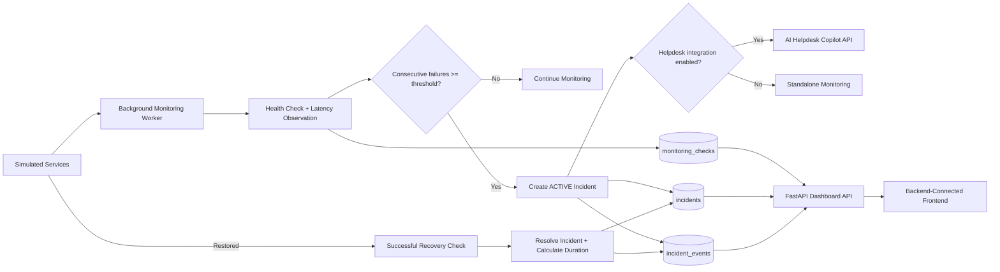
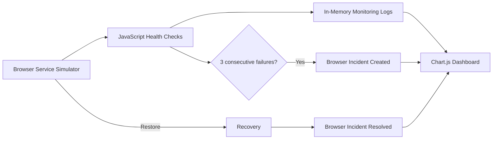

# Architecture

The project intentionally has two execution paths: a full engineering implementation and an instant static recruiter demo.

## Full engineering implementation



## GitHub Pages demo



The GitHub Pages path intentionally contains no FastAPI, SQLAlchemy or PostgreSQL execution. Those technologies are represented by the full repository implementation.

## Backend components

### FastAPI application

Provides:

- service-control endpoints
- monitoring-cycle endpoint
- monitoring history
- incident history
- incident event timeline
- operational metrics
- dashboard aggregation

### Monitoring worker

Runs on a configurable interval and performs checks across configured services.

Default:

```text
MONITOR_INTERVAL_SECONDS=2
```

### Incident engine

An incident is created only after the configured consecutive-failure threshold.

Default:

```text
FAILURE_THRESHOLD=3
```

### Recovery engine

A successful check on a service with an ACTIVE incident:

1. marks the incident RESOLVED
2. records `resolved_at`
3. calculates outage duration
4. creates a RECOVERY incident event

### Persistence

SQLAlchemy models:

- `monitored_services`
- `monitoring_checks`
- `incidents`
- `incident_events`

Local development defaults to SQLite.

Docker Compose uses PostgreSQL.

## Frontends

### `frontend/`

Real backend-connected dashboard.

It expects FastAPI at:

```text
http://127.0.0.1:8000
```

### root `index.html` + `assets/`

Standalone recruiter demo for GitHub Pages.

This version simulates the monitoring logic in browser memory.

## Cross-project integration

When enabled:

```text
Network Monitoring & Incident System
        ↓
incident created
        ↓
AI Helpdesk Copilot /tickets
        ↓
support workflow
```

Integration is optional and failure-safe.

## Safety

The project uses simulated services rather than probing arbitrary third-party systems. This keeps the portfolio demo repeatable and avoids creating traffic against systems the project does not own.
