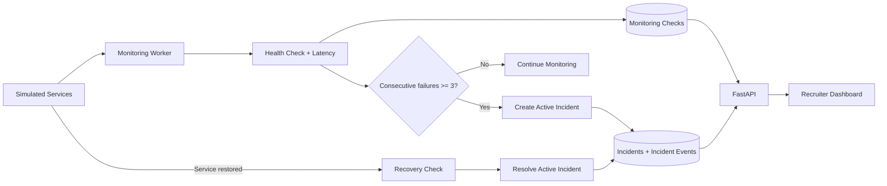

# Architecture

## Data model

- `monitored_services`: service identity, simulated state and current failure streak.
- `monitoring_checks`: timestamped availability, HTTP code and latency result.
- `incidents`: automatically created after repeated failures and automatically resolved after recovery.
- `incident_events`: lifecycle timeline for incident creation, continued failure and recovery.

## Monitoring rule

A single failed check does not create an incident. The default threshold is three consecutive failures. This reduces alert noise and demonstrates false-positive-aware monitoring behaviour.
